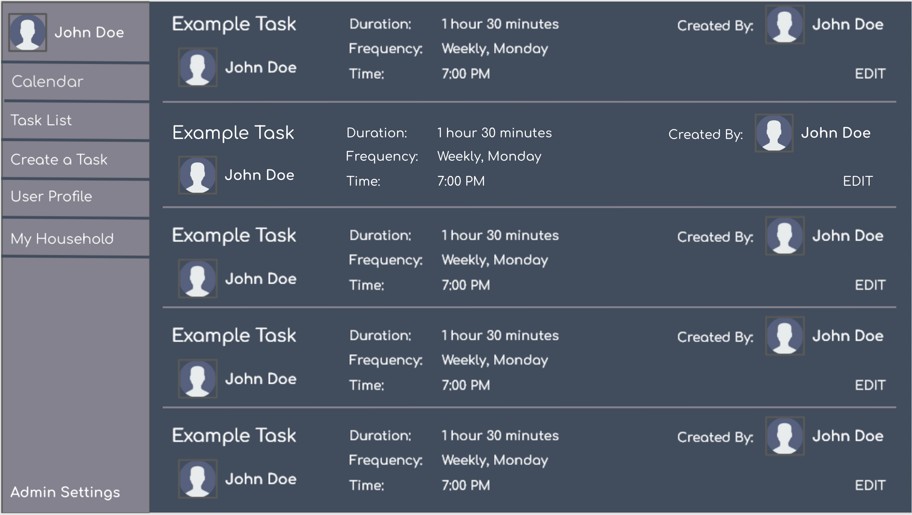
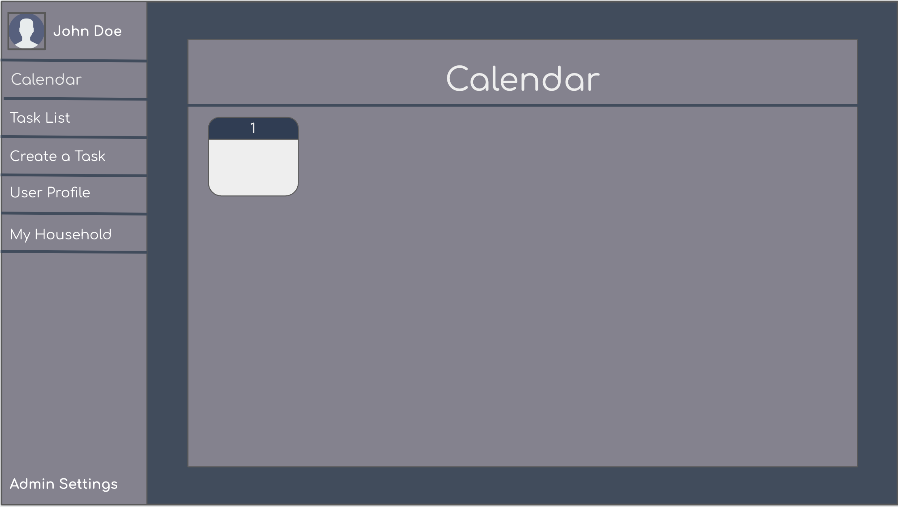
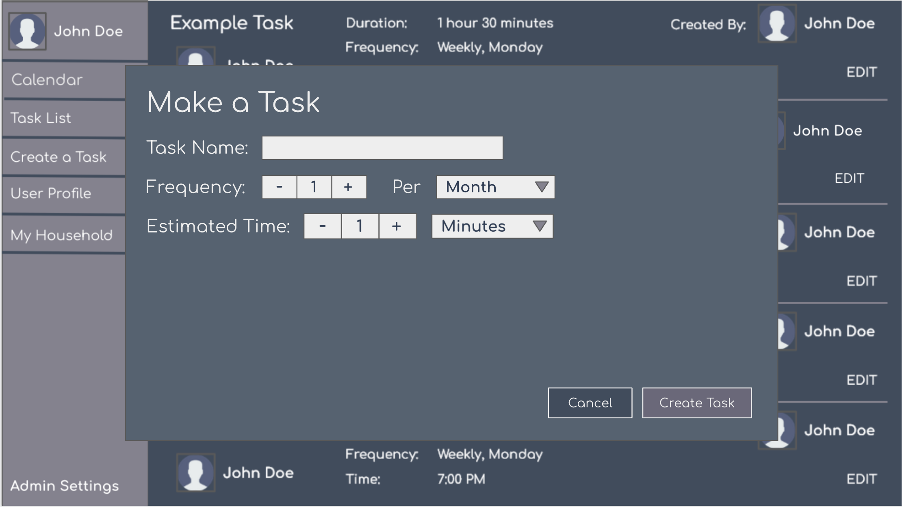

# CIS371-FinalProject

# Info
This project is hosted in a AWS EC2 Instance and deployed with github pages. Because it is deployed on github pages, it is not possible to navigate to any page other than / yourself and you have to be directed by the app.

You can view this project at [http://cymbre.com/CIS371-FinalProject/](http://cymbre.com/CIS371-FinalProject/).

## Project Description
This project is a home chore scheduling app that will schedule chores that need to be done however often in order to distribute household workload.

It will incorporate a calendar aspect in order to allow the user to schedule tasks around events such as going on vacation and be able to see the predicted schedule.

The app will include user login and identification in order to identify users and will collect email and household information in order to notify users about tasks.

The app will have a household feature so that multiple people in the same household can be assigned separate tasks.

The algorithm will assign tasks based on past task completion in order to optimize household workload. It may also assign tasks based on task preference of users.

# Mockups

## Requirements
* The app must allow the user to enter cleaning tasks and how often they would like it to get done.
* Users are able to specify in their user profile their prefferred cleaning times/days of the week.
* Users must be able to log in to the app.
* Users must be able to be grouped into household groups and share household information.
* The application will send users emails when it is time for their tasks to be completed.
* There will be a calendar view containing when tasks will be due.
* Users will be able to add events to the calendar that affect the cleaning schedule. 
    * Maybe good to account for repeating schedules.
* Users are able to move cleaning events from the calendar view.
* Ability to have admin users for the household.
* Ability for admin users to assign other users tasks (e.g. parent assigns child tasks)

## Views
* Calendar View
* Task list view
* Task creation view
* User profile view
* Admin view
* Group view

# Tools we are thinking of using
* Amazon SES - sends emails
* AWS Lambda - server?
* Amazon Cognito - user login, sign up security
* Amazon Dynamo DB - database stuff - can we host it on the server?

